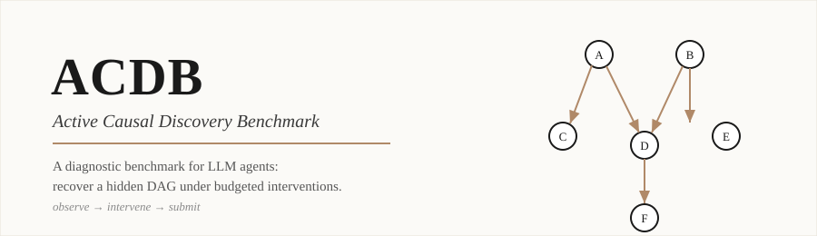
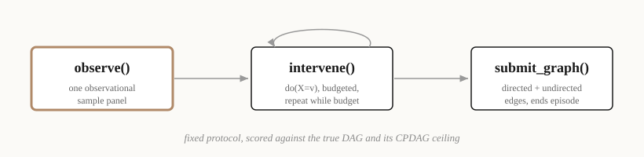
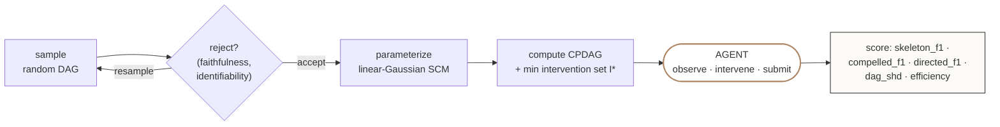

<div align="center">



<p>
  
  
  
  
</p>

</div>

> **Can a language model discover causal structure?** ACDB hands an agent a hidden linear-Gaussian system, an observational sample, and a strict intervention budget — then scores how much of the true causal graph it can recover, and how efficiently. A fixed `observe → intervene → submit` protocol, a layered scoring contract, and classical structure-learning baselines on the exact same instances.

Code release for *Active Causal Discovery as a Diagnostic Benchmark for LLM Agents*.

---

## The task in one picture

<div align="center">
  
</div>

The agent sees only anonymized variables and the data it asks for. The evaluator owns the truth — the DAG `G`, its CPDAG ceiling, the SCM, and a minimum intervention set `I*`. That asymmetry is what makes the scoring layered and the task honest.



## Headline result

Directed-edge F1, averaged across all six difficulty levels (`d = 4 … 14` variables). `pc_greedy` is the classical structure-learning baseline; `oracle` is the benchmark ceiling; the random floor sits at **0.12 – 0.22** depending on level.

| Model | `llm_raw` | `llm_stats` | `+ cpdag_greedy` | `pc_greedy` (baseline) | `oracle` |
|---|:---:|:---:|:---:|:---:|:---:|
| **GPT-5.5** | **0.748** | 0.700 | 0.474 | 0.709 | 1.000 |
| Sonnet 4.6 | 0.346 | 0.213 | 0.350 | 0.709 | 1.000 |
| Gemini 3 Flash | 0.323 | 0.279 | 0.510 | 0.709 | 1.000 |
| GPT-5.4-mini | 0.158 | 0.142 | 0.125 | 0.709 | 1.000 |
| Haiku 4.5 | 0.149 | 0.166 | 0.313 | 0.709 | 1.000 |

> Only **GPT-5.5 raw** clears the classical PC-greedy baseline; every other configuration lands below it, and the gap widens as the graph grows. Causal structure recovery under budgeted intervention is **not** yet a solved capability — which is the point.
> <br/>*(Numbers reproduce from `traces/aggregated/per_model_per_level_per_method.csv`.)*

---

## What the benchmark measures

Each instance is built from a hidden linear-Gaussian SCM over `d` variables:

```
X_i = sum_{j in Pa(i)} w_ij X_j + eps_i,   eps_i ~ N(0, sigma_i^2)
```

The agent only ever sees anonymized variables, an observational sample matrix, and any interventional samples it requests. The evaluator owns the rest: the true DAG `G`, its CPDAG (the observational ceiling), the parameterized SCM, and a benchmark-owned minimum intervention set `I*` that resolves `G` from its CPDAG. This asymmetry is what makes scoring layered.

**Two truth objects, four scoring layers.** Observational data identifies a Markov equivalence class, not a unique DAG. ACDB therefore scores against two distinct objects -- the CPDAG and the DAG -- and reports four metrics:

- `skeleton_f1` -- adjacency recovery against `G`.
- `compelled_f1` -- direction recovery against the directed edges of CPDAG(`G`) (the part observational data alone is allowed to identify).
- `directed_f1`, `dag_shd` -- full directed-edge recovery against `G`.
- `efficiency` -- intervention budget used relative to `|I*|`.

A model can fail on adjacencies, on observational orientations, on interventional orientations, or on intervention budgeting -- and ACDB reports each separately.

**Random floor.** With `M = d(d-1)/2` candidate edges, a uniform-`m` random submission has closed-form expected directed F1
```
E[F1] = (1/(M+1)) * sum_{m=0..M} k*m / (M*(m+k))
```
For each level the README's results table reports `directed_f1` alongside this floor so a number above it is meaningful and a number near it is not.

**Active protocol.** `observe()` returns the observational panel exactly once. `intervene(var, value)` returns one interventional sample matrix per call while budget remains. `submit_graph(directed_edges, undirected_edges)` ends the episode -- leaving an edge undirected is a legitimate output, distinct from omitting it.

## Repository layout

```
run_ladder.py                 main runner (model panels, ablations)
run_random_dag_baseline.py    random uniform-m baseline (Appendix C)
src/causal_discovery/         benchmark assembly, agents, scoring, SCM
scripts/extract_trace_rows.py trace -> per-step CSV (Appendix F)
scripts/ladder_random_floor_sanity.py  Monte Carlo random-floor calibration
traces/ladder/full_*          5 canonical model panels
traces/aggregated/            per-cell aggregate + 5 per-trace CSVs
traces/ladder_random_floor_sanity/     calibration outputs
```

## Reproduce results

### 1. Install

Requires Python >= 3.12 and `uv`.

```bash
uv sync
```

### 2. API keys

Create `.env` at the repo root with the keys for the panels you want to rerun:

```
OPENAI_API_KEY=sk-...
ANTHROPIC_API_KEY=sk-ant-...
OPENROUTER_API_KEY=sk-or-...
```

The runner refuses to launch if a required key is missing. OpenRouter is used for the Claude panels and Gemini in the paper; replace the `--models` string with a native provider if you prefer.

### 3. Run a panel

The five paper panels are produced by the same command, varying only `--models` and `--out-dir`. The retry envvar enables auto-resume on transient provider errors (default 0):

```bash
LADDER_MAX_RETRIES=20 uv run python run_ladder.py \
    --levels 0,1,2,3,4,5 \
    --seeds-per-level 8 \
    --models gpt-5.5 \
    --alpha 0.05 \
    --max-steps-raw 20 \
    --max-steps-stats 40 \
    --preflight-seed 20260422 \
    --out-dir traces/ladder/full_gpt55
```

`--preflight-seed 20260422` reproduces the 48-seed paired manifest used by every panel, so results are paired by instance across models. The same accepted-seed map appears in every panel's `run_manifest.json`.

| Panel             | `--models`                                       | `--out-dir`                            |
|-------------------|--------------------------------------------------|----------------------------------------|
| GPT-5.5           | `gpt-5.5`                                        | `traces/ladder/full_gpt55`             |
| GPT-5.4-mini      | `gpt-5.4-mini`                                   | `traces/ladder/full_gpt54mini`         |
| Claude Sonnet 4.6 | `openrouter/anthropic/claude-sonnet-4-6`         | `traces/ladder/full_sonnet46_or`       |
| Claude Haiku 4.5  | `openrouter/anthropic/claude-haiku-4.5`          | `traces/ladder/full_haiku45_or`        |
| Gemini 3 Flash    | `google/gemini-3-flash-preview`                  | `traces/ladder/full_gemini3flash`      |

### 4. Smoke test (one level, one seed)

```bash
uv run python run_ladder.py \
    --levels 0 \
    --seeds-per-level 1 \
    --models gpt-5.5 \
    --out-dir traces/ladder/smoke_gpt55
```

### 5. Random-floor calibration (Appendix C)

```bash
uv run python scripts/ladder_random_floor_sanity.py
```

Produces `traces/ladder_random_floor_sanity/summary.csv` -- the Monte Carlo floor that Appendix C compares to the closed form above.

### 6. Resume / retry

`run_ladder.py` checkpoints to `<out-dir>/checkpoint.json` after every work item. To resume an interrupted panel, rerun the exact same command -- it picks up where it left off. To retry only the failed items:

```bash
uv run python run_ladder.py ... --retry-failed
```

## Outputs per panel

Each `--out-dir` ends up with:

- `events.jsonl` -- full event log: `instance_metadata`, `llm_model_call` (request, raw response, parsed action, tokens, cost), `llm_action`, `llm_tool_result`, `llm_intervention_result`, `work_success`/`work_failed`. This is what reviewers can re-score from.
- `results_long.csv` -- one row per (level, seed, method) cell with the four scoring layers.
- `results_summary.csv` -- per-method aggregates within the panel.
- `run_manifest.json` -- exact CLI args, model string, accepted-seed map.
- `checkpoint.json` -- resume state.

## Verifying the paper numbers

The body and appendices aggregate across panels into `traces/aggregated/per_model_per_level_per_method.csv`. Every number in the paper is recomputable from this file plus the per-panel `results_long.csv`. The five per-trace CSVs (`traces/aggregated/trace_*_*.csv`) underlie the case studies in Appendix F.

## Software

- Python >= 3.12 (`pyproject.toml`).
- LLM dispatch: `litellm` >= 1.79; native OpenAI calls via `openai` >= 2.30.
- PC inference: `causal-learn` >= 0.1.4.5.
- Plus `numpy`, `pandas`, `python-dotenv`, `tenacity`. Locked in `uv.lock`.
