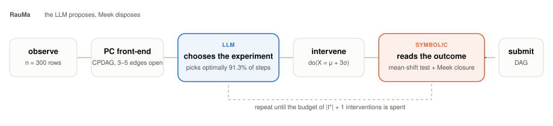
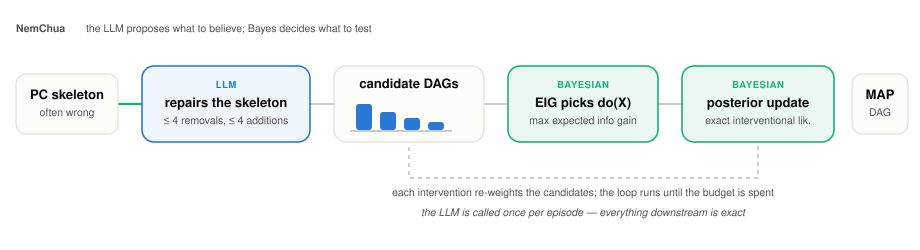

<div align="center">



<br/>


<br/><br/>

**Two independent studies of language-model agents doing active causal discovery.**<br/>
Each hands an agent a hidden linear-Gaussian system, one observational sample, and a<br/>
budget of roughly three interventions — then asks for the full directed graph.

<br/>

<table>
<tr>
<td width="50%" valign="top">

### 🧭 &nbsp;RauMa

**Which half of the job do LLMs fail at?**

Factorise the agent into *who chooses the experiment* × *who reads the result*, then run
the whole 5 × 2 cross-product on paired instances.

**→ Choosing is solved. Reading is not.**
The entire end-to-end gap is inference; selection contributes nothing.

<a href="#rauma"><b>Read the study ↓</b></a>

</td>
<td width="50%" valign="top">

### 🔬 &nbsp;NemChua

**Can an LLM supply the hypothesis space?**

Let the model repair a structure-learner's skeleton, then let exact Bayesian experimental
design do everything downstream.

**→ Yes — and only while data is scarce.**
Beats the classical pipeline by **+0.093 F1**, with the gain vanishing as *n* grows.

<a href="#nemchua"><b>Read the study ↓</b></a>

</td>
</tr>
</table>

</div>

> [!NOTE]
> **The two studies are independent.** They share a benchmark and a codebase, nothing else.
> Neither uses the other as a baseline, and neither's conclusions depend on the other's.

---

## The task

Observational data identifies a DAG only up to its **Markov equivalence class**: the
skeleton is recoverable, many edge orientations are not. Interventions are the only way to
resolve them. Each episode gives the agent:

```
observe()                 →  one observational sample, n = 300
intervene(var, value)     →  a hard intervention, repeatable under budget
submit_graph()            →  one final directed graph, scored against hidden truth
```

The budget is `|I*| + 1`, where `I*` is the **minimum intervention set** the evaluator
computes from the true DAG — so budgets are tiny, typically 3 and never more than 5.

<div align="center">

| Level | `d` | `k` | size of `I*` | budget | PC undirected edges | MEC size | PC skeleton-F1 ceiling |
|:-----:|:---:|:---:|:------------:|:------:|:-------------------:|:--------:|:----------------------:|
| **0** | 4 | 4 | 1.40 | 2.40 | 2.6 | 4.5 | 0.900 |
| **1** | 6 | 6 | 1.70 | 2.70 | 2.6 | 4.6 | 0.956 |
| **2** | 8 | 8 | 1.80 | 2.80 | 3.3 | 6.5 | 0.946 |
| **3** | 10 | 10 | 2.20 | 3.20 | 4.6 | 11.4 | 0.951 |

</div>

The ladder is calibrated so the PC front-end is **competent but imperfect**. Denser graphs
collapse both studies: PC's skeleton is then wrong so often that every arm hits the same
low ceiling and no experiment can help.

Two deliberately small, cheap models, both through OpenRouter with forced tool-calling at
temperature 0: **`qwen3-coder-30b-a3b-instruct`** and **`gpt-4o-mini-2024-07-18`**.

Every arm sees the **same seed map**, so all comparisons are **paired by instance**. Every
significance test below is a two-sided Wilcoxon signed-rank over those pairs, reported
alongside win/tie/loss counts — ties dominate on this benchmark and a p-value alone hides
that.

<br/>

---

<div align="center">

<a id="rauma"></a>

# 🧭 RauMa — *the LLM proposes, Meek disposes*

</div>

<div align="center">

</div>

Active causal discovery needs two skills that are almost always measured together:

<div align="center">

| | |
|:--|:--|
| **Selection** | which variable should I intervene on next? |
| **Inference** | given this outcome, which way does the arrow point? |

</div>

RauMa separates them. Fix one axis, vary the other, and each skill is isolated:

| Axis | Levels |
|---|---|
| **Selector** | `random` · `maxdeg` · `eig` (exact BOED over the enumerated MEC) · `llm` · `oracle` (the true `I*`) |
| **Inferencer** | `meek` (mean-shift test + Meek closure) · `llm` |
| **Reference** | `llm_e2e` — one LLM does everything, no scaffold |

### The gap is entirely inference

<div align="center">

</div>

<div align="center">

| Model | ceiling | full LLM agent | total gap | **selection** | **inference** |
|:---|---:|---:|---:|---:|---:|
| `qwen3-coder-30b` | 0.836 | 0.520 | 0.316 | **−0.025** <sub>p = 0.072</sub> | **+0.279** <sub>p = 2.5e-07</sub> |
| `gpt-4o-mini` | 0.836 | 0.533 | 0.303 | **−0.021** <sub>p = 0.173</sub> | **+0.320** <sub>p = 5.6e-08</sub> |

</div>

The selection term is **negative** — letting the LLM choose experiments is, if anything,
slightly better than the minimum intervention set. The inference term is significant at
p ≈ 1e-07, with the LLM losing on **36 of 40** instances.

<div align="center">

</div>

Moving **down** a column changes almost nothing. Moving **across** a row costs ~0.3 F1.
`llm+meek` on qwen is the best of all eighteen arms at **0.861**.

### Why inference fails: the LLM ignores its own experiments

<details open>
<summary><b>Selection held at oracle — the diagnostic table</b></summary>

<br/>

| Inferencer | directed F1 | compelled F1 | skeleton F1 | SHD | edges left undirected |
|:---|---:|---:|---:|---:|---:|
| `meek` | **0.836** | 0.925 | 0.938 | 1.25 | 0.00 |
| `llm` · qwen | 0.557 | 0.914 | 0.917 | 3.65 | 0.68 |
| `llm` · gpt-4o-mini | 0.516 | 0.864 | 0.830 | 4.12 | 0.85 |

</details>

<br/>

qwen's skeleton stays essentially intact (0.917 vs 0.938), and its *compelled* edges —
the ones already oriented in the observational CPDAG — are near-perfect (0.914 vs 0.925).
Only the edges that **require interventional evidence** collapse.

> **The LLM reproduces the observational CPDAG and largely ignores the interventional
> evidence it was given.**

That is a specific, falsifiable mechanism — not "the LLM is bad at graphs".

The `meek` ceiling is 0.836 rather than 1.0 because the mean-shift test itself misorients
**5.6 %** of edges at `n_int = 150` (11.1 % at *d* = 6, falling to 2.2 % at *d* = 10). The
0.28 gap is measured against an already-imperfect reference.

### LLM selection matches exact Bayesian experimental design

<div align="center">

</div>

<div align="center">

| Selector | picks the optimal target | selection regret | directed F1 |
|:---|---:|---:|---:|
| `oracle` | 100.0 % | 0.00 | 0.836 |
| `maxdeg` | 92.8 % | 0.15 | 0.857 |
| **`llm` · qwen** | **91.3 %** | **0.18** | **0.861** |
| `eig` (BOED) | 90.0 % | 0.17 | 0.857 |
| `llm` · gpt-4o-mini | 84.7 % | 0.43 | 0.856 |
| `random` | 60.8 % | 1.35 | 0.843 |

</div>

A 30B open model picks interventions as well as expected information gain computed exactly
over the enumerated equivalence class: **39 of 40 instances tie**, p = 0.32.

> [!IMPORTANT]
> **We do not claim a speed advantage.** At these sizes exact EIG is *faster* than the LLM
> — 0.033 s versus 4.6 s at *d* = 10, where `|MEC| = 11.4`. The claim is **generality**:
> EIG needs the full likelihood and an enumerable equivalence class; the LLM needs a prompt.

The right-hand panel is the caveat. Selection regret spans a 9-fold range while directed F1
does not move — with one spare intervention, a bad choice stays recoverable.

### Tighten the budget and the selection axis wakes up

<div align="center">

</div>

Same graphs, same observational data, same seeds — budget cut from `|I*| + 1` to `|I*|`.
Slack plays no part in the instance rejection policy, so the tight run is paired with the
main run instance by instance.

<div align="center">

| Comparison | main · p / W-T-L | **tight · p / W-T-L** |
|:---|:---|:---|
| RauMa (qwen) vs `random` | 0.285 · 7-30-3 | **0.017 · 12-23-5** |
| `eig` vs `random` | 0.534 · 7-29-4 | 0.061 · 12-22-6 |
| RauMa (qwen) vs `eig` | 0.317 · 1-39-0 | 0.500 · 3-35-2 |

</div>

Under a tight budget RauMa is the **only** rule that separates from random — exact EIG does
not (p = 0.061) — while still tying EIG.

> [!WARNING]
> **Stated against interest:** the effect is small (0.032 F1) and p = 0.017 is uncorrected.
> Across these five comparisons it would not survive a Bonferroni threshold of 0.01.

### The scaffold is worth more than the model

<div align="center">

</div>

<div align="center">

| Arm | tokens in | tokens out | calls | $ / episode | directed F1 |
|:---|---:|---:|---:|---:|---:|
| **RauMa** · gpt-4o-mini | 944 | 78 | 1.82 | $0.00019 | 0.856 |
| **RauMa** · qwen | 1 395 | 98 | 1.77 | $0.00031 | **0.861** |
| no scaffold · gpt-4o-mini | 35 163 | 241 | 3.77 | $0.00365 | **0.000** |
| no scaffold · qwen | 51 556 | 477 | 3.77 | $0.00749 | 0.152 |

</div>

Removing the scaffold costs **+0.353 F1** (qwen, 33-2-5) and **+0.532** (gpt-4o-mini,
34-6-0) while spending **30× more tokens**.

<details>
<summary><b>About that 0.000 — it is not a crash</b></summary>

<br/>

Every episode completed. Under 35 k tokens of raw data, gpt-4o-mini submits
`submit_directed = 0.00` and `submit_undirected = 5.03`: it returns **every edge
undirected**, abstaining from orientation entirely, so directed F1 is zero by construction.
Its compelled F1 is 0.275. The mechanism is the finding; the bare zero is not.

</details>

<br/>

---

<div align="center">

<a id="nemchua"></a>

# 🔬 NemChua — *the LLM proposes what to believe*

</div>

<div align="center">

</div>

NemChua keeps a posterior over a **finite set of candidate DAGs**, picks each intervention
by expected information gain over that set, and updates the posterior on the exact
interventional likelihood. The LLM's only job is to **repair PC's skeleton** — propose up to
four edge removals and four additions — which seeds the candidate set. One LLM call per
episode; everything downstream is exact.

Half the hypothesis budget is reserved for the **unedited** PC skeleton, so the model's
edits can only ever add hypotheses, never delete good ones.

### NemChua beats the classical pipeline

<div align="center">

</div>

<div align="center">

| Comparison · paired, n = 40 | Δ F1 | p | W-T-L |
|:---|---:|---:|:---|
| **NemChua** (gpt-4o-mini) vs `pc_greedy_meek` | **+0.093** | **0.0008** | 14-25-**1** |
| **NemChua** (qwen) vs `pc_greedy_meek` | +0.059 | 0.047 | 13-23-4 |
| **NemChua** (qwen) vs `llm_e2e` | **+0.736** | <1e-07 | **40-0-0** |

</div>

NemChua reaches **0.950** (gpt-4o-mini) and **0.916** (qwen) against **0.857** for the
classical PC + greedy + Meek pipeline, and **0.000 – 0.180** for an end-to-end LLM agent.

### What each component is worth

<div align="center">

</div>

<div align="center">

| Remove … | Δ F1 | p |
|:---|---:|---:|
| an informed hypothesis space → random | +0.568 | <1e-07 |
| the Bayesian posterior update | +0.293 | <1e-07 |
| skeleton **repair** → whole-graph proposals | +0.236 | <1e-07 |
| the hybrid space → PC's MEC alone | +0.073 | 0.024 |
| the LLM proposer → PC skeleton alone | +0.027 qwen · **+0.060 gpt** | 0.20 · **0.0075** |
| EIG selection → random selection | +0.021 | 0.21 |
| BIC weighting | +0.003 | — |

</div>

Two results deserve emphasis. **Asking the LLM to repair a skeleton beats asking it for
whole graphs by 0.236 F1** — the design choice is load-bearing, not cosmetic. And **EIG
selection does not significantly beat random selection** (p = 0.21): within this
architecture, the value sits in the hypothesis space, not the decision rule.

### Why it works: a better search space

<div align="center">

</div>

<div align="center">

| Hypothesis source | true DAG is in the space | best F1 reachable |
|:---|---:|---:|
| random | 0.025 | 0.477 |
| LLM whole graphs · qwen | 0.125 | 0.693 |
| PC MEC | 0.400 | 0.847 |
| PC skeleton | 0.425 | 0.932 |
| **NemChua** · qwen | 0.500 | 0.944 |
| **NemChua** · gpt-4o-mini | **0.575** | **0.954** |

</div>

Skeleton repair raises the probability that the true DAG is even *available* to the
posterior from **42.5 % to 57.5 %**.

### The crossover: the LLM helps only when data is scarce

<div align="center">

</div>

<div align="center">

| `n_obs` | 40 | 60 | 120 | 300 | 1000 |
|:---|---:|---:|---:|---:|---:|
| **NemChua − PC-skeleton-only** | **+0.058** | +0.018 | +0.010 | −0.021 | −0.009 |

</div>

Monotone, crossing zero at `n_obs ≈ 150`.

> **The LLM proposer earns its keep exactly where PC's skeleton is unreliable, and becomes
> a mild liability once PC is reliable.**

This is the practically useful statement: it says *when* to spend an LLM call.

<details>
<summary><b>Consistency check — the same story on a second axis</b></summary>

<br/>

In the `main` run (`n_obs` = 300, levels 0–3) the LLM contribution is +0.060 for
gpt-4o-mini, apparently contradicting the −0.021 above. Broken out by level:

| level | `d` | PC skeleton only | Δ gpt-4o-mini | Δ qwen |
|:---:|:---:|---:|---:|---:|
| 0 | 4 | 0.786 | **+0.175** | **+0.104** |
| 1 | 6 | 0.920 | +0.045 | +0.003 |
| 2 | 8 | 0.932 | +0.000 | −0.011 |
| 3 | 10 | 0.920 | +0.021 | +0.011 |

The gain concentrates at *d* = 4, where the data-to-variable ratio is effectively lowest.
Same story, second axis: **the LLM helps when the front-end is starved** — whether by small
*n* or by an unfavourable *n/d* ratio. The two ablations agree.

</details>

<br/>

---

## Threats to validity

<table>
<tr><td width="34%"><b>Two small models only</b></td>
<td>Every claim is scoped to small, cheap models. Nothing here licenses a statement about frontier models, for which the balance may well differ.</td></tr>

<tr><td><b>RauMa's tight-budget effect is small and uncorrected</b></td>
<td>It supports "the axis is live under pressure", not "selection matters a lot".</td></tr>

<tr><td><b>NemChua's <code>n_obs</code> sweep is not comparable to <code>main</code></b></td>
<td><code>build_seed_map</code> shares one RNG stream across levels, so <code>--levels 1,2</code> and <code>--levels 0,1,2,3</code> draw disjoint seeds (0/10 overlap, verified). The sweep is internally paired across all five settings; it must not be cross-referenced against <code>main</code>.</td></tr>

<tr><td><b>Synthetic SCMs</b></td>
<td>Linear-Gaussian, faithful by construction, no latent confounding.</td></tr>

<tr><td><b>The symbolic ceiling is not 1.0</b></td>
<td>The mean-shift test misorients 5.6 % of edges, so reported inference gaps are relative to an imperfect reference.</td></tr>
</table>

---

## Reproducibility

<div align="center">

| Run | episodes | completed | cost | tokens |
|:---|---:|---:|---:|---:|
| RauMa — main | 720 | 720 | $0.636 | 4 145 832 |
| RauMa — tight budget | 240 | 240 | $0.023 | 89 313 |
| NemChua — main | 960 | 960 | $0.719 | 4 465 522 |
| **Total** | **1 920** | **100 %** | **$1.378** | **8.7 M** |

</div>

- **All non-LLM arms are deterministic.** Two independent runs of 60 model-free episodes
  reproduced byte-identical scores, so run-to-run variation isolates LLM nondeterminism.
- **Schema reliability:** 0.009 repair calls per episode in RauMa, 0.003 in NemChua, and
  **zero** failed calls across all 1 920 episodes.
- Error bars are 95 % CIs over **paired instances**, not over repeated runs — a single run
  already contains 40 paired instances per arm.

```bash
bash scripts/setup_env.sh                 # conda env `acdb-active`, verifies install, runs 25 tests
bash scripts/study1.sh all                # RauMa   — main + tight budget + n_obs + alpha + d12
bash scripts/study2.sh all                # NemChua — main + n_obs sweep + edits + skeleton hint
python scripts/make_figures.py --result-dir result --out-dir figures
```

Every stage checkpoints per episode and takes `--resume`; re-running the same command
continues where it stopped.

<details>
<summary><b>Repository map</b></summary>

<br/>

| Path | Contents |
|:---|:---|
| `src/causal_discovery/active/` | selectors, inferencers, exact MEC enumeration, Gaussian likelihoods |
| `run_study1_decompose.py` | **RauMa** — the 5 × 2 grid + end-to-end reference |
| `run_study2_probe.py` | **NemChua** — the method and its 15 arms |
| `scripts/study{1,2}.sh` | every stage reported above |
| `scripts/make_figures.py` | all nine figures, PNG at 300 dpi + PDF |
| `result/` | episode-level CSVs the figures are drawn from |
| `docs/BENCHMARK.md` | the underlying ACDB benchmark and its own release |
| `docs/REPO_OVERVIEW.md` · `docs/IDEAS.md` | benchmark internals · design rationale |
| `docs/RUNNING_ON_SERVER.md` | server runbook |

**Naming.** `RauMa` is the `llm+meek` arm and `NemChua` is the `probe` arm; the CSVs keep
those internal identifiers so raw data stays greppable.

</details>

---

<div align="center">

## What to take away

<table>
<tr>
<td width="33%" align="center"><h3>1</h3><b>Don't hand an LLM the whole loop</b><br/><br/><sub>Unscaffolded it scores 0.000 – 0.180 against a 0.836 symbolic ceiling, while burning 30× the tokens.</sub></td>
<td width="33%" align="center"><h3>2</h3><b>Give it the half it is good at</b><br/><br/><sub>Small LLMs choose interventions as well as exact Bayesian design — and cannot convert outcomes into orientations. Let a symbolic engine read.</sub></td>
<td width="33%" align="center"><h3>3</h3><b>Or give it what Bayes cannot do alone</b><br/><br/><sub>Proposing what to believe. A better hypothesis space beats the classical pipeline — but only while that pipeline is starved of data.</sub></td>
</tr>
</table>

</div>
