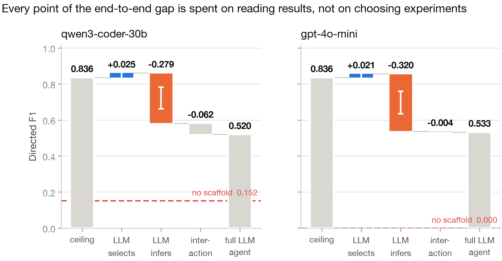
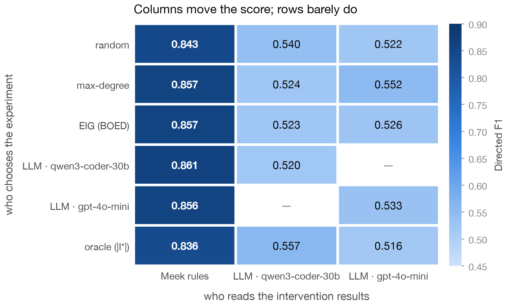
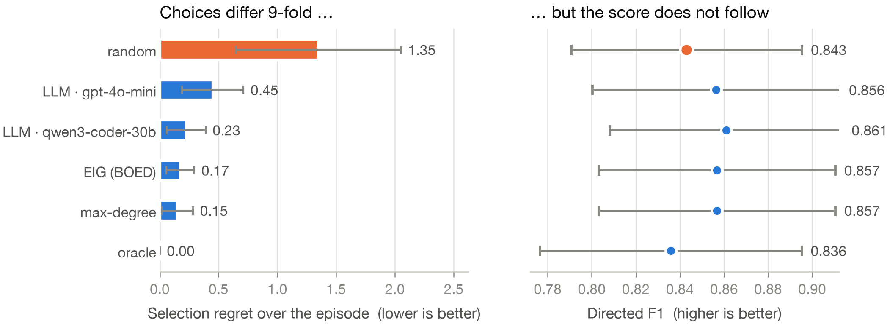
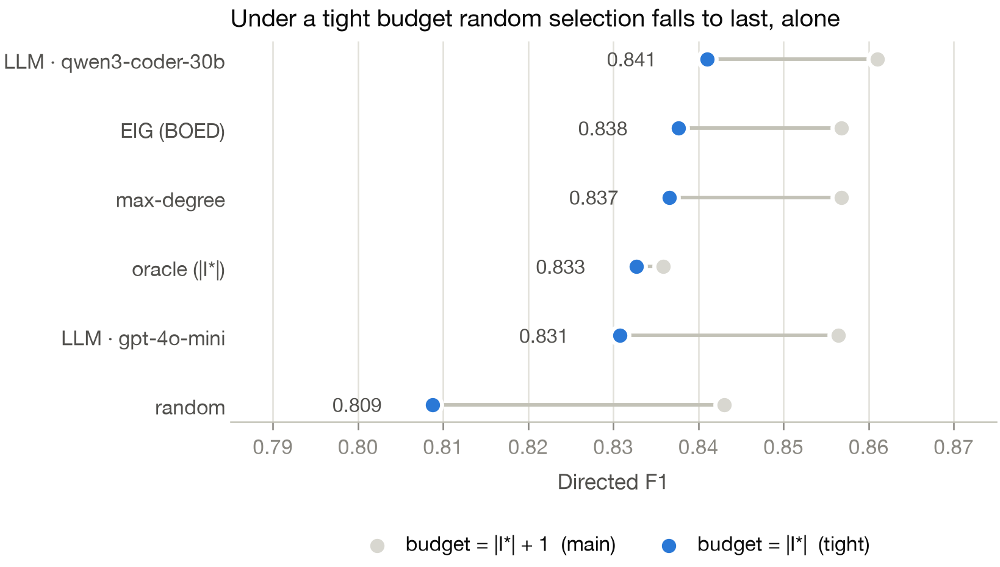
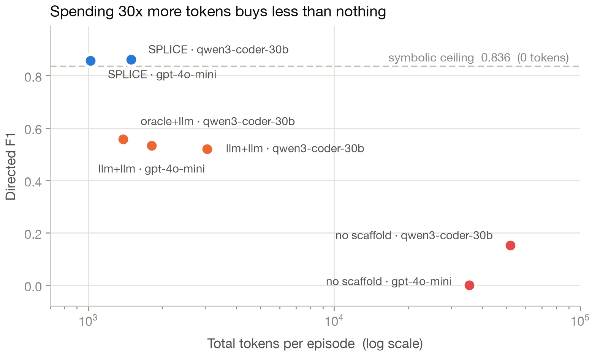
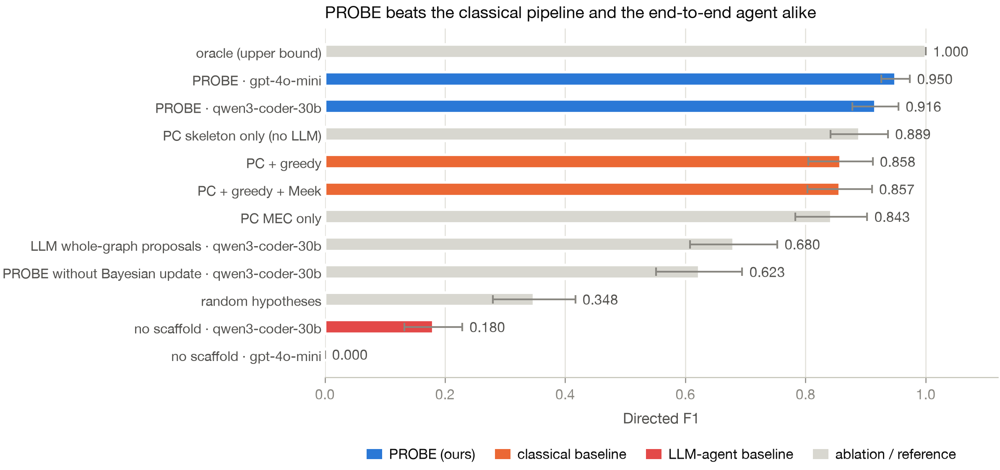
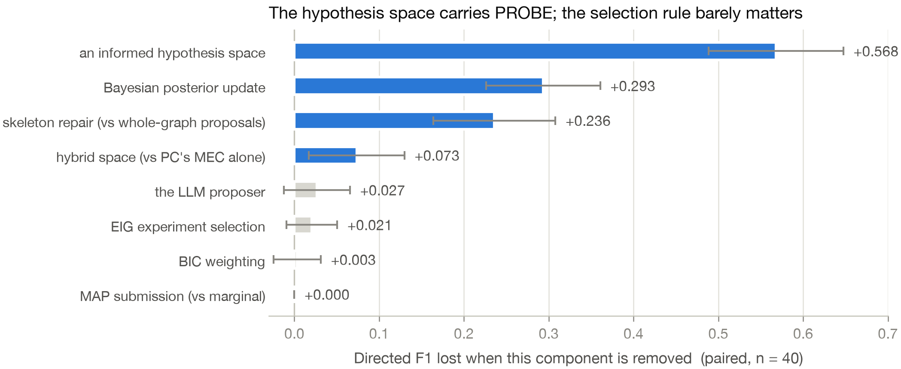
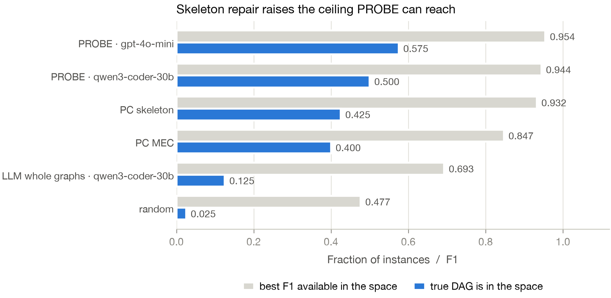
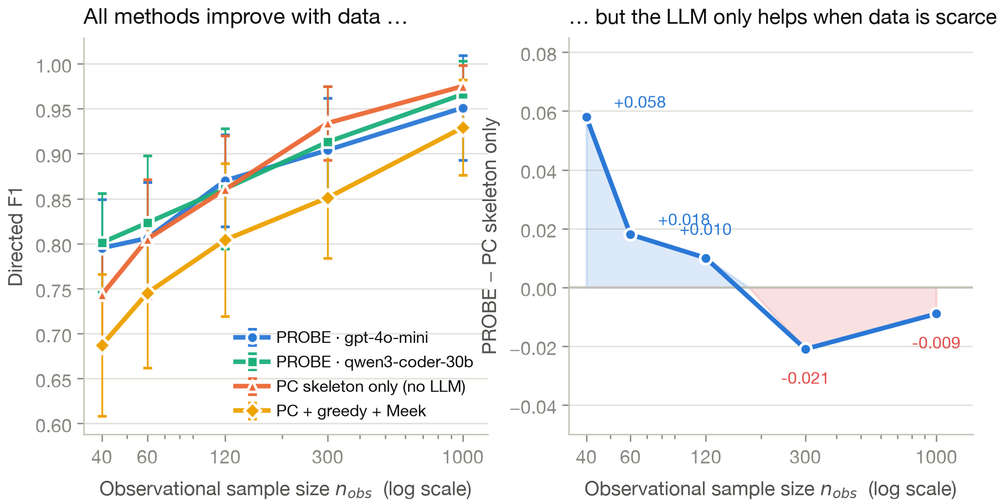

# Which half of active causal discovery should an LLM do?

Two studies on LLM-driven active causal discovery, run on the Active Causal Discovery
Benchmark (ACDB). An agent sees observational data from a hidden linear-Gaussian SCM,
may run a small number of interventions, and must submit the full directed graph.

**1 920 episodes · 100 % completed · $1.38 total · two small open/cheap models.**

| | Study 1 — SPLICE | Study 2 — PROBE |
|---|---|---|
| **Question** | Which half of the job do LLMs actually fail at? | Can an LLM supply the hypothesis space a Bayesian designer searches? |
| **Answer** | Choosing experiments is solved; reading results is not. | Yes, and it pays off exactly where the classical front-end is unreliable. |
| **Headline** | 100 % of the end-to-end gap is inference; 0 % is selection | PROBE beats the classical pipeline by **+0.093 F1** (p = 0.0008) |
| **Type** | diagnostic / analysis | method |

---

## 1. Setup

### 1.1 The task

Observational data identifies a DAG only up to its **Markov equivalence class**: the
skeleton is recoverable but many edge orientations are not. Interventions are the only
way to resolve them. Each episode gives the agent:

1. `observe()` — one observational sample of size `n_obs`;
2. `intervene(var, value)` — a hard intervention, repeatable up to a budget;
3. `submit_graph()` — one final directed graph, scored against the hidden truth.

The budget is `|I*| + 1`, where `I*` is the **minimum intervention set** computed by the
evaluator from the true DAG. Budgets are therefore tiny — typically 3, at most 5.

| Level | d | k | \|I*\| | budget | PC undirected edges | \|MEC\| | PC skeleton-F1 ceiling |
|---|:-:|:-:|:-:|:-:|:-:|:-:|:-:|
| 0 | 4 | 4 | 1.40 | 2.40 | 2.6 | 4.5 | 0.900 |
| 1 | 6 | 6 | 1.70 | 2.70 | 2.6 | 4.6 | 0.956 |
| 2 | 8 | 8 | 1.80 | 2.80 | 3.3 | 6.5 | 0.946 |
| 3 | 10 | 10 | 2.20 | 3.20 | 4.6 | 11.4 | 0.951 |

The ladder is calibrated so PC is a *competent but imperfect* front-end. Denser graphs
collapse the study: PC's skeleton is then wrong so often that every arm hits the same
low ceiling and no experiment can help.

### 1.2 Models and protocol

Two deliberately small, cheap models, both via OpenRouter with forced tool-calling at
temperature 0: **qwen3-coder-30b-a3b-instruct** and **gpt-4o-mini-2024-07-18**.

Every arm sees the **same seed map**, so all comparisons are **paired by instance**. All
significance tests are two-sided Wilcoxon signed-rank on those pairs, and we report
win/tie/loss counts alongside p-values because ties dominate on this benchmark.

---

## 2. Study 1 — SPLICE: decomposing the agent

*Selection by Prompting, Logical Inference for Causal Experiments.*
**The LLM proposes, Meek disposes.**

Active causal discovery needs two skills that are usually measured together:

> **Selection** — which variable should I intervene on next?
> **Inference** — given this intervention outcome, which way does the arrow point?

We cross 5 selectors × 2 inferencers (+ an unscaffolded reference), so fixing one axis
and varying the other isolates each skill.

| Axis | Levels |
|---|---|
| **Selector** | `random` · `maxdeg` · `eig` (exact BOED over the enumerated MEC) · `llm` · `oracle` (the true `I*`) |
| **Inferencer** | `meek` (mean-shift test + Meek closure) · `llm` |
| **Reference** | `llm_e2e` — one LLM does everything, no scaffold |

### 2.1 Result: the gap is entirely inference



| Model | ceiling | full LLM agent | total gap | **selection** | **inference** |
|---|---:|---:|---:|---:|---:|
| qwen3-coder-30b | 0.836 | 0.520 | 0.316 | **−0.025** (p = 0.072) | **+0.279** (p = 2.5e-07) |
| gpt-4o-mini | 0.836 | 0.533 | 0.303 | **−0.021** (p = 0.173) | **+0.320** (p = 5.6e-08) |

The selection term is **negative** — letting the LLM choose experiments is, if anything,
slightly *better* than the minimum intervention set. The inference term is significant at
p ~ 1e-07 with the LLM losing on **36 of 40** instances.



The grid makes it visual: moving down a column changes almost nothing, moving across a
row costs ~0.3 F1. `llm+meek` with qwen is the **best of all 18 arms** at 0.861.

### 2.2 Why inference fails: the LLM ignores the interventions

With selection held at oracle:

| Inferencer | directed F1 | compelled F1 | skeleton F1 | SHD | edges left undirected |
|---|---:|---:|---:|---:|---:|
| `meek` | **0.836** | 0.925 | 0.938 | 1.25 | 0.00 |
| `llm` · qwen | 0.557 | 0.914 | 0.917 | 3.65 | 0.68 |
| `llm` · gpt-4o-mini | 0.516 | 0.864 | 0.830 | 4.12 | 0.85 |

qwen's skeleton is essentially intact (0.917 vs 0.938) and its *compelled* edges — the
ones already oriented in the observational CPDAG — are nearly perfect (0.914 vs 0.925).
Only the edges that **require interventional evidence** collapse.

> **The LLM reproduces the observational CPDAG and largely ignores the interventional
> evidence it was given.**

This is a specific, falsifiable mechanism, not "the LLM is bad at graphs".

The `meek` ceiling is 0.836 rather than 1.0 because the mean-shift test itself
misorients **5.6 %** of edges at n_int = 150 (11.1 % at d = 6, falling to 2.2 % at d = 10).
The 0.28 gap is measured against an already-imperfect reference.

### 2.3 LLM selection matches exact Bayesian experimental design



| Selector | picks the optimal target | selection regret | directed F1 |
|---|---:|---:|---:|
| `oracle` | 100.0 % | 0.00 | 0.836 |
| `maxdeg` | 92.8 % | 0.15 | 0.857 |
| **`llm` · qwen** | **91.3 %** | **0.18** | **0.861** |
| `eig` (BOED) | 90.0 % | 0.17 | 0.857 |
| `llm` · gpt-4o-mini | 84.7 % | 0.43 | 0.856 |
| `random` | 60.8 % | 1.35 | 0.843 |

A 30B open model picks interventions as well as expected-information-gain computed
exactly over the enumerated equivalence class: **39 of 40 instances tie**, p = 0.32.

We do **not** claim a speed advantage. At these sizes exact EIG is *faster* than the LLM
(0.033 s vs 4.6 s at d = 10, |MEC| = 11.4). The claim is about **generality**: EIG needs
the full likelihood and an enumerable equivalence class; the LLM needs a text prompt.

The right-hand panel is the caveat: selection regret spans a 9-fold range while directed
F1 does not move. With one spare intervention, a bad choice is recoverable.

### 2.4 Tighten the budget and the selection axis wakes up



Same graphs, same observational data, same seeds — budget cut from `|I*| + 1` to `|I*|`.
(Slack plays no part in the instance rejection policy, so the tight run is paired with the
main run instance by instance.)

| Comparison | main: p / W-T-L | **tight: p / W-T-L** |
|---|---|---|
| SPLICE (qwen) vs `random` | 0.285 · 7-30-3 | **0.017 · 12-23-5** |
| `eig` vs `random` | 0.534 · 7-29-4 | 0.061 · 12-22-6 |
| SPLICE (qwen) vs `eig` | 0.317 · 1-39-0 | 0.500 · 3-35-2 |

Under a tight budget SPLICE is the **only** rule that separates from random — exact EIG
does not (p = 0.061) — while still tying EIG. **Stated honestly:** the effect is small
(0.032 F1) and p = 0.017 is uncorrected; across these five comparisons it would not
survive a Bonferroni threshold of 0.01.

### 2.5 The scaffold is worth more than the model



| Arm | tokens in | tokens out | calls | $ / episode | directed F1 |
|---|---:|---:|---:|---:|---:|
| SPLICE · gpt-4o-mini | 944 | 78 | 1.82 | $0.00019 | 0.856 |
| SPLICE · qwen | 1 395 | 98 | 1.77 | $0.00031 | **0.861** |
| no scaffold · gpt-4o-mini | 35 163 | 241 | 3.77 | $0.00365 | **0.000** |
| no scaffold · qwen | 51 556 | 477 | 3.77 | $0.00749 | 0.152 |

Removing the scaffold costs **+0.353 F1** (qwen, 33-2-5) and **+0.532** (gpt-4o-mini,
34-6-0) while spending **30× more tokens**.

**On the 0.000.** It is not a crash — every episode completed. Under 35 k tokens of raw
data, gpt-4o-mini submits `submit_directed = 0.00` and `submit_undirected = 5.03`: it
returns *every edge undirected*, abstaining from orientation entirely, so directed F1 is
zero by construction (its compelled F1 is 0.275). Report the mechanism, not the bare zero.

---

## 3. Study 2 — PROBE: an LLM-proposed hypothesis space

PROBE keeps a posterior over a **finite set of candidate DAGs**, picks each intervention
by expected information gain over that set, and updates the posterior on the exact
interventional likelihood. The LLM's only job is to **repair PC's skeleton** — propose up
to 4 edge removals and 4 additions — which seeds the candidate set.

Half the hypothesis budget is reserved for the *unedited* PC skeleton, so LLM edits can
only ever add hypotheses, never delete good ones.

### 3.1 Result: PROBE beats the classical pipeline



| Comparison (paired, n = 40) | Δ F1 | p | W-T-L |
|---|---:|---:|---|
| PROBE (gpt-4o-mini) vs `pc_greedy_meek` | **+0.093** | **0.0008** | 14-25-**1** |
| PROBE (qwen) vs `pc_greedy_meek` | +0.059 | 0.047 | 13-23-4 |
| PROBE (qwen) vs `llm_e2e` | **+0.736** | <1e-07 | **40-0-0** |

PROBE reaches **0.950** (gpt-4o-mini) and **0.916** (qwen) against **0.857** for the
classical PC + greedy + Meek pipeline and **0.180 / 0.000** for the end-to-end agent.

### 3.2 What each component is worth



| Remove … | Δ F1 | p |
|---|---:|---:|
| an informed hypothesis space (→ random) | +0.568 | <1e-07 |
| the Bayesian posterior update | +0.293 | <1e-07 |
| skeleton repair (→ whole-graph proposals) | +0.236 | <1e-07 |
| the hybrid space (→ PC's MEC alone) | +0.073 | 0.024 |
| the LLM proposer (→ PC skeleton alone) | +0.027 qwen · **+0.060 gpt** | 0.20 · **0.0075** |
| EIG selection (→ random selection) | +0.021 | 0.21 |
| BIC weighting | +0.003 | — |

Two results worth flagging. First, **asking the LLM to repair a skeleton beats asking it
for whole graphs by 0.236 F1** — the design choice is load-bearing. Second, **EIG
selection does not significantly beat random selection here either** (p = 0.21),
independently reproducing Study 1's finding on a completely different architecture.

### 3.3 Why it works: a better search space



| Hypothesis source | true DAG is in the space | best F1 reachable |
|---|---:|---:|
| random | 0.025 | 0.477 |
| LLM whole graphs · qwen | 0.125 | 0.693 |
| PC MEC | 0.400 | 0.847 |
| PC skeleton | 0.425 | 0.932 |
| PROBE · qwen | 0.500 | 0.944 |
| **PROBE · gpt-4o-mini** | **0.575** | **0.954** |

Skeleton repair raises the probability that the true DAG is even *available* to the
posterior from 42.5 % to 57.5 %.

### 3.4 The crossover: the LLM helps only when data is scarce



| n_obs | 40 | 60 | 120 | 300 | 1000 |
|---|---:|---:|---:|---:|---:|
| **PROBE − PC-skeleton-only** | **+0.058** | +0.018 | +0.010 | −0.021 | −0.009 |

Monotone, crossing zero around n_obs ≈ 150.

> **The LLM proposer earns its keep exactly where PC's skeleton is unreliable, and becomes
> a mild liability once PC is reliable.**

This is the paper's most useful practical statement: it says *when* to spend an LLM call.

**Consistency check.** In the `main` run (n_obs = 300, levels 0–3) the LLM contribution is
+0.060 for gpt-4o-mini — apparently contradicting the −0.021 above. Broken out by level:

| level | d | PC skeleton only | Δ gpt-4o-mini | Δ qwen |
|---|:-:|---:|---:|---:|
| 0 | 4 | 0.786 | **+0.175** | **+0.104** |
| 1 | 6 | 0.920 | +0.045 | +0.003 |
| 2 | 8 | 0.932 | +0.000 | −0.011 |
| 3 | 10 | 0.920 | +0.021 | +0.011 |

The gain is concentrated at d = 4, where the data-to-variable ratio is effectively lowest.
Same story, second axis: **the LLM helps when the front-end is starved**, whether by small
n or by an unfavourable n/d ratio. The two ablations agree.

---

## 4. Threats to validity

1. **Only two small models.** Every claim is scoped to small, cheap models. Nothing here
   licenses a statement about frontier models — for those the selection/inference balance
   may well differ.
2. **The tight-budget effect is small and uncorrected.** See §2.4. It supports "the axis
   is live under pressure", not "selection matters a lot".
3. **The n_obs sweep is not comparable to `main` instance-by-instance.** `build_seed_map`
   shares one RNG stream across levels, so `--levels 1,2` and `--levels 0,1,2,3` draw
   disjoint seeds (0/10 overlap, verified). The sweep is internally paired across all five
   n_obs settings; it must not be cross-referenced against `main`.
4. **Synthetic linear-Gaussian SCMs**, faithful by construction, no latent confounding.
5. **The symbolic ceiling is not 1.0** — the mean-shift test misorients 5.6 % of edges,
   so reported inference gaps are relative to an imperfect reference.

---

## 5. Reproducibility

| Run | episodes | completed | cost | tokens |
|---|---:|---:|---:|---:|
| Study 1 main | 720 | 720 | $0.636 | 4 145 832 |
| Study 1 tight budget | 240 | 240 | $0.023 | 89 313 |
| Study 2 main | 960 | 960 | $0.719 | 4 465 522 |
| **Total** | **1 920** | **100 %** | **$1.378** | **8.7 M** |

- **All non-LLM arms are deterministic.** Two independent runs of 60 model-free episodes
  reproduced byte-identical scores, so run-to-run variation isolates LLM nondeterminism.
- **Schema reliability:** 0.009 repair calls per episode in Study 1, 0.003 in Study 2;
  **zero** failed calls across all 1 920 episodes.
- Error bars are 95 % CIs over **paired instances**, not over repeated runs — one run
  already contains 40 paired instances per arm.

### Reproduce

```bash
bash scripts/setup_env.sh
bash scripts/study1.sh all      # main + tight budget + n_obs + alpha + d12
bash scripts/study2.sh all      # main + n_obs sweep + edits + skeleton-hint + alpha
python scripts/make_figures.py --result-dir result --out-dir figures
```

Every stage checkpoints per episode and takes `--resume`; re-running the same command
continues where it stopped.

### Repository map

| Path | Contents |
|---|---|
| `src/causal_discovery/active/` | selectors, inferencers, PROBE, exact MEC enumeration, Gaussian likelihoods |
| `run_study1_decompose.py` | the 5 × 2 grid + end-to-end reference |
| `run_study2_probe.py` | PROBE and its 15 arms |
| `scripts/study{1,2}.sh` | every stage in the paper |
| `scripts/make_figures.py` | all nine figures |
| `figures/` | PNG (300 dpi) + PDF |
| `docs/REPO_OVERVIEW.md` | the underlying benchmark |
| `docs/RUNNING_ON_SERVER.md` | server runbook |

---

## 6. What to take away

1. **Do not hand an LLM the whole active-discovery loop.** Unscaffolded it scores 0.000–0.180
   against a 0.836 symbolic ceiling while burning 30× the tokens.
2. **Give it the half it is good at.** Small LLMs choose interventions as well as exact
   Bayesian experimental design, and cannot reliably convert intervention outcomes into
   edge orientations — so let a symbolic engine do the reading.
3. **Or give it the half a Bayesian designer cannot do alone:** proposing what to believe.
   PROBE beats the classical pipeline by supplying a better hypothesis space — but only
   while the classical front-end is starved of data.
